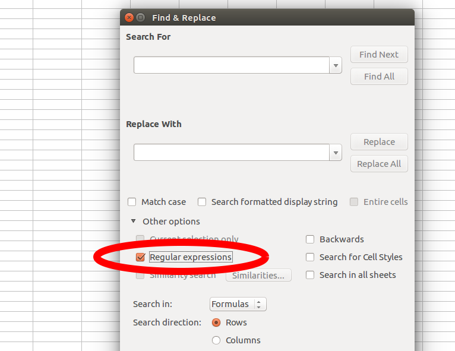

  
# Wstęp

## Co to są wyrażenia regularne?

Oxforddictionaries.com:

"A sequence of symbols and characters expressing a string or pattern to be searched for within a longer piece of text." 

IRD:

**Reguła decyzyjna** wskazująca, jaki fragment tekstu lub wzorzec ma być poszukiwany w tekście.

# Dygresja - R i praca z tekstem

```{r}
(x <- "Ala ma kota.")
grepl(pattern = "Ala", x)
grepl(pattern = "Eugeniusz", x)
```

# Dygresja - R i praca z tekstem

```{r}
gsub(pattern = "Ala", replacement = "Alicja", x)
gsub(pattern = "a", replacement = "_", x)
cat(gsub(pattern = "a", replacement = "_", x))
```

# Wyrażenia regularne - sposób działania

```{r}
x <- "Ala ma kota. Inaczej: Alicja Kowalska, 
urodzona 12 marca 1994 r. (1994-03-12) 
w Cendrowicach, gm. Góra Kalwaria, 
jest posiadaczką zwierzęcia z rodziny kotowatych."
```

# Najprostszy wariant - zwykły fragment tekstu

```{r}
cat(gsub("Ala", "Alicja", x))
cat(gsub("a", "_", x))
```

# Kropka zastępuje dowolny symbol

```{r}
cat(gsub("a.", "_", x))
```

# Należy z nią uważać

```{r}
cat(gsub(".", "_", x))
```

# A co, jeśli interesuje nas normalna kropka?

```{r}
cat(gsub("\\.", "_", x))
```

# Zbiory i zakresy

[...] wyłapuje dowolny znak ze zbioru wewnątrz nawiasów kwadratowych (można używać zakresów).

[^...] wyłapuje dowolny znak SPOZA zbioru wewnątrz nawiasów kwadratowych (też można używać zakresów).

# Przykład użycia zbiorów i zakresów

```{r}
cat(gsub("[A-Z]", "_", x))
cat(gsub("[a-z]", "_", x))
```

# Przykład użycia zbiorów i zakresów
```{r}
cat(gsub("[0-9]", "_", x))
```

# Przykład użycia zbiorów i zakresów

```{r}
cat(gsub("[A-Za-zżźćńółęąśŻŹĆĄŚĘŁÓŃ]", "_", x))
cat(gsub("[A-Za-zżźćńółęąśŻŹĆĄŚĘŁÓŃ]+", "_", x))
```


# Symbole specjalne stawiane za znakiem lub grupą znaków

`*`: 0 lub więcej wystąpień

+: co najmniej 1 wystąpienie

?: co najwyżej 1 wystąpienie

{n}: dokładnie n wystąpień

{n,}: co najmniej n wystąpień

{n,m}: między n a m wystąpień

# Przykłady

```{r}
cat(gsub("A[a-z]+a", "_", x))
```

# Przykłady

```{r}
cat(gsub("kot[a-z]*", "_", x))
```

# Przykłady

```{r}
cat(gsub("[0-9]{4}-[0-9]{2}-[0-9]{2}",
         "DATA_ISO", x))
cat(gsub("[0-9]{2} [a-zżźćńółęąś]+ [0-9]{4} r\\.",
         "DATA_PL", x))
```

# Symbole specjalne

^: początek tekstu

```{r}
cat(gsub("A[a-z]+" ,"_", x))
cat(gsub("^A[a-z]+" ,"_", x))
```

# Symbole specjalne

$: koniec tekstu

```{r}
cat(gsub("[a-z]+h.{1}" ,"_", x))
cat(gsub("[a-z]+h.{1}$" ,"_", x))
```
# Symbole specjalne
`\\b`: kraniec (początek lub koniec) wyrazu
|: operator logiczny "lub"

```{r}
cat(gsub("[Aa]" ,"_", x))
cat(gsub("\\b[Aa]|[Aa]\\b" ,"_", x))
```

# Zastosowania

## Czyszczenie danych (również ilościowych)
```{r}
nrs_txt <- 
"1000 zł
2  000PLN
3,000
4.000.34
5.000,99
6oO0"
```

# Wczytujemy dane
```{r}
nrs <- read.csv(text = nrs_txt, 
                stringsAsFactors = FALSE,
                header = FALSE, sep = ';')[[1]]
```

# Naiwna próba
```{r}
as.numeric(nrs)
```

# Na początek pozbądźmy się spacji i liter
```{r}
nrs2 <- gsub("[ A-Za-zżźćńółęąśŻŹĆĄŚĘŁÓŃ]+",
            "", nrs)
cat(nrs2)
```
Falstart! Niektóre zera zostały błędnie rozpoznane przez OCR jako litery "o". Co teraz?

# Spróbujmy ostrożniej:
```{r}
nrs <- gsub(" +|[pPzZ]+[A-Za-zżźćńółęąśŻŹĆĄŚĘŁÓŃ]+$", 
            "", nrs)
cat(nrs)
```
Pozbyliśmy się spacji i oznaczeń waluty.

# O != 0
```{r}
nrs <- gsub("(o|O){1}", 
            "0", nrs)
cat(nrs)
```
Naprawiliśmy zera błędnie rozpoznane jako "o".

# Kropki dziesiętne, przecinki tysięczne, przecinki dziesiętne, kropki tysięczne?
##Teraz będzie trudniej
```{r}
nrs <- gsub("(\\.|\\,)([0-9]{2})$", "decdot\\2", nrs)
cat(nrs)
```
Zastosowaliśmy grupowanie za pomocą nawiasów i zwracanie fragmentów wyłapanego tekstu.

# Kropki dziesiętne, przecinki tysięczne, przecinki dziesiętne, kropki tysięczne?
```{r}
nrs <- gsub("\\.|\\,", "", nrs)
cat(nrs)
```
Pozbywamy się reszty przecinków i kropek.

# Kropki dziesiętne, przecinki tysięczne, przecinki dziesiętne, kropki tysięczne?
```{r}
nrs <- gsub("decdot", ".", nrs)
cat(nrs)
```
Przywracamy kropki dziesiętne na ich właściwe miejsca.

# Chwila prawdy
```{r}
as.numeric(nrs)
```

# Inne zastosowania
